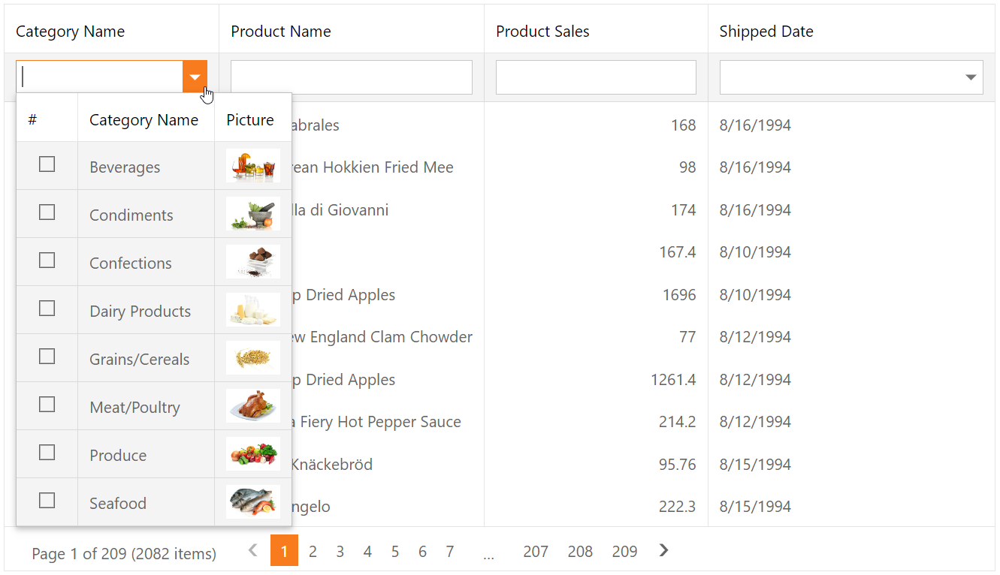

<!-- default badges list -->

[](https://supportcenter.devexpress.com/ticket/details/E4521)
[](https://docs.devexpress.com/GeneralInformation/403183)
<!-- default badges end -->
# Grid View for ASP.NET Web Forms - How to implement a filter row template and use ASPxGridLookup as an editor
<!-- run online -->
**[[Run Online]](https://codecentral.devexpress.com/128536219/)**
<!-- run online end -->

This example demonstrates how to create a column's filter row template, add the ASPxGridLookup control to the template, and configure the column's filter functionality.



## Overview

1. Create the [Grid View](https://docs.devexpress.com/AspNet/DevExpress.Web.ASPxGridView) control, populate it with columns, and bind it to a data source. Set the grid's [ShowFilterRow](https://docs.devexpress.com/AspNet/DevExpress.Web.ASPxGridViewSettings.ShowFilterRow) property to `true` to show the [filter row](https://docs.devexpress.com/AspNet/3753/components/grid-view/concepts/filter-data/filter-row).

    ```aspx
    <dx:ASPxGridView runat="server" ID="Grid" AutoGenerateColumns="False" DataSourceID="ProductsDataSource"
        ClientInstanceName="grid" OnCustomCallback="Grid_CustomCallback" EnableViewState="false">
        <Columns>
            <dx:GridViewDataTextColumn FieldName="CategoryName">
                <!-- ... -->
            </dx:GridViewDataTextColumn>
            <dx:GridViewDataTextColumn FieldName="ProductName" />
            <dx:GridViewDataTextColumn FieldName="ProductSales" />
            <dx:GridViewDataDateColumn FieldName="ShippedDate" />
        </Columns>
        <Settings ShowFilterRow="true" />
    </dx:ASPxGridView>
    ```

2. Specify a column's [FilterTemplate](https://docs.devexpress.com/AspNet/DevExpress.Web.GridViewColumn.FilterTemplate) property, add an [ASPxGridLookup](https://docs.devexpress.com/AspNet/DevExpress.Web.ASPxGridLookup) editor to the template, populate the editor with columns, and bind it to a data source.

    ```aspx
    <dx:GridViewDataTextColumn FieldName="CategoryName">
        <FilterTemplate>
            <dx:ASPxGridLookup runat="server" ID="Lookup" AutoGenerateColumns="False" KeyFieldName="CategoryID"
                DataSourceID="CategoriesDataSource" SelectionMode="Multiple" TextFormatString="{0}">
                <Columns>
                    <dx:GridViewCommandColumn ShowSelectCheckbox="true" />
                    <dx:GridViewDataTextColumn FieldName="CategoryName" />
                    <dx:GridViewDataBinaryImageColumn FieldName="Picture">
                        <PropertiesBinaryImage ImageWidth="48" />
                    </dx:GridViewDataBinaryImageColumn>
                </Columns>
                <ClientSideEvents ValueChanged="Lookup_ValueChanged" />
            </dx:ASPxGridLookup>
        </FilterTemplate>
    </dx:GridViewDataTextColumn>
    ```

3. Handle the editor's client-side [ValueChanged](https://docs.devexpress.com/AspNet/js-ASPxClientEdit.ValueChanged) event. In the handler, call the grid's client-side `PerformCallback` method to send a callback to the server.

    ```js
    function Lookup_ValueChanged(s, e) {
        grid.PerformCallback("FilterByCategories");
    }
    ```

4. Handle the grid's server-side `CustomCallback` event. In the handler, create custom filter criteria based on the edit value and call the grid's [ApplyFilterToColumn](https://docs.devexpress.com/AspNet/DevExpress.Web.ASPxGridView.ApplyFilterToColumn(DevExpress.Web.GridViewDataColumn-DevExpress.Data.Filtering.CriteriaOperator)) method to apply the filter criteria to the grid.

    ```csharp
    protected void Grid_CustomCallback(object sender, ASPxGridViewCustomCallbackEventArgs e) {
        if(e.Parameters == "FilterByCategories") {
            var column = Grid.DataColumns["CategoryName"];
            var lookup = Grid.FindFilterCellTemplateControl(column, "Lookup") as ASPxGridLookup;
            if(lookup != null)
                Grid.ApplyFilterToColumn(column, CreateCriteria(lookup, column.FieldName));
        }
    }

    protected CriteriaOperator CreateCriteria(ASPxGridLookup gridLookup, string fieldName) {
        var values = gridLookup.GridView.GetSelectedFieldValues(fieldName);
        return values.Count > 0 ? new InOperator(fieldName, values) : null;
    }
    ```

## Files to Review

* [Default.aspx](./CS/WebSite/Default.aspx) (VB: [Default.aspx](./VB/WebSite/Default.aspx))
* [Default.aspx.cs](./CS/WebSite/Default.aspx.cs) (VB: [Default.aspx.vb](./VB/WebSite/Default.aspx.vb))

## Documentation

* [Grid View Templates](https://docs.devexpress.com/AspNet/3718/components/grid-view/concepts/templates)
* [Filter Template](https://docs.devexpress.com/AspNet/DevExpress.Web.GridViewColumn.FilterTemplate)
